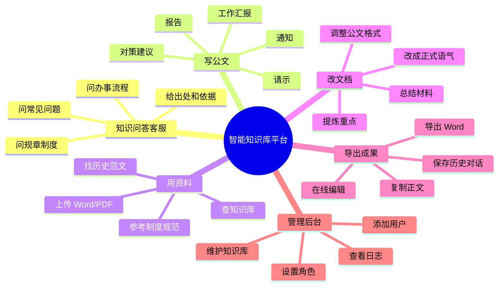
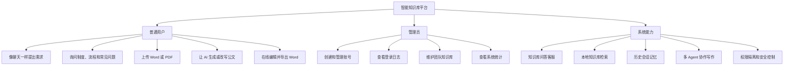
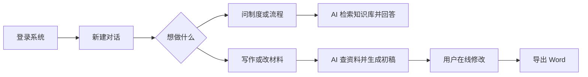
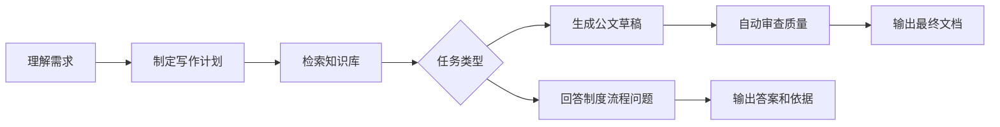

# 智能知识库平台项目思维导图

> 小白理解版：这是一个给单位内部使用的 AI 知识客服和办公助手，重点解决“问制度、查流程、写公文、改材料、导出 Word、管理知识库”这些事。

## 一图看懂

## 更清晰的功能地图

## 小白版说明

这个项目可以理解成一个“单位专属智能知识库客服和 AI 办公平台”。

普通用户最常用它做五件事：

1. 问制度：例如请假制度、报销规则、用印要求、会议室预约流程。
2. 查流程：例如某件事应该找谁、先做什么、需要准备哪些材料。
3. 写材料：例如通知、请示、报告、汇报、对策建议。
4. 改材料：把已有 Word/PDF 上传后，让 AI 总结、改写、规范格式。
5. 出成果：在网页里继续编辑，最后导出 Word 文档。

管理员主要负责三件事：

1. 管账号：添加用户、设置普通用户或管理员。
2. 管资料：把规章制度、办事流程、模板、范文上传到知识库。
3. 看状态：查看登录日志、系统统计、知识库健康情况。

## 用户使用流程

## AI 内部怎么工作

## 一句话总结

这个项目既可以作为单位内部的“智能知识库客服”，随时回答规章制度和办事流程问题，也可以帮助用户基于本地资料快速生成、修改、审查并导出规范 Word 公文。
