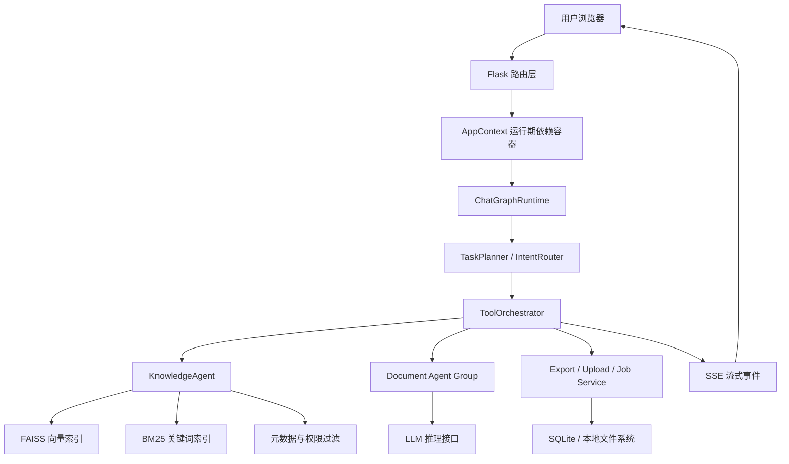
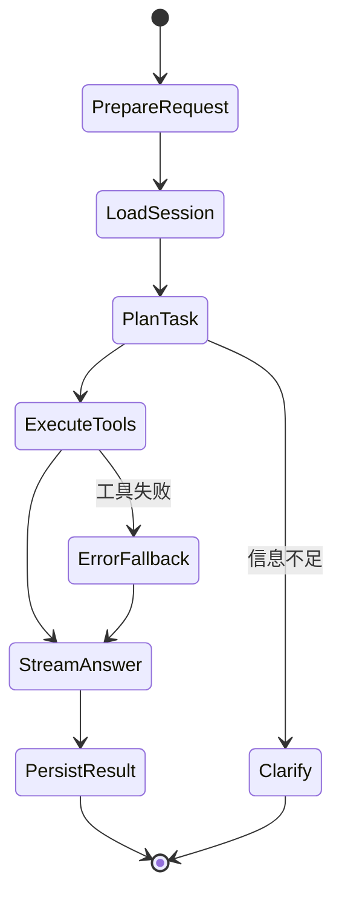
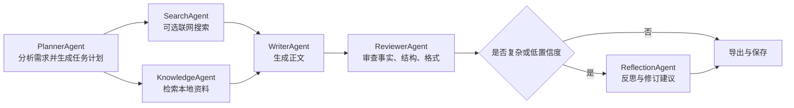
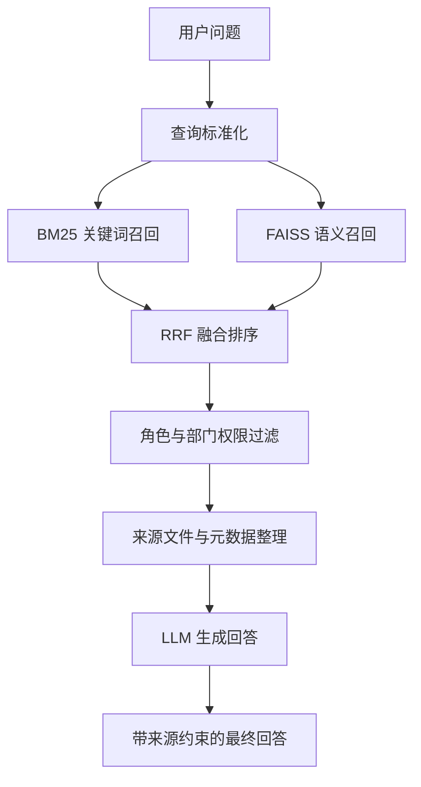

# 基于 RAG 与 LangGraph 的智能知识库问答与文档生成系统

## 项目定位

本项目是一个面向毕业设计场景实现的智能知识库问答与文档生成系统。系统以 **RAG（Retrieval-Augmented Generation，检索增强生成）** 为核心技术路线，以 **LangGraph 状态图编排** 和 **多 Agent 协作** 为主要工程设计方法，将本地知识库、结构化表格、文档生成、后台管理和大语言模型能力整合到一套可运行的 Web 应用中。

需要说明的是，本项目并不是简单调用大模型 API。大模型在系统中只承担“语言理解与文本生成引擎”的角色，真正的毕业设计重点在于：

- 如何把用户请求拆解为可执行的任务状态；
- 如何用 LangGraph 管理复杂对话流程和工具调用顺序；
- 如何设计 Planner、Knowledge、Writer、Reviewer、Reflection 等 Agent 的职责边界；
- 如何把 FAISS 语义检索、BM25 关键词检索、RRF 融合排序和权限过滤组合成可追溯的 RAG 链路；
- 如何通过 SSE 流式协议把 Agent 思考、检索、生成和审查过程反馈给前端；
- 如何用 Flask service 层、运行期依赖容器、后台任务和本地存储实现工程化落地。

因此，大模型 API 是系统中的一个可替换推理组件，而不是系统本身。即使更换为其他兼容 OpenAI SDK 的模型服务，系统的 Agent 编排、RAG 检索、权限过滤、任务管理和前端流式交互设计仍然保留。

## 系统功能

| 功能模块 | 说明 |
| --- | --- |
| 智能问答 | 基于 `/api/chat` 提供 SSE 流式回答，支持知识库问答、澄清追问和身份说明 |
| RAG 检索增强 | 使用 FAISS、BM25、RRF 和来源元数据增强回答可靠性 |
| 多 Agent 文档生成 | 通过规划、检索、写作、审查、反思等 Agent 生成文档草稿 |
| LangGraph 编排 | 使用状态图组织聊天主链路和文档生成子流程 |
| 知识库管理 | 支持上传、解析、切分、入库、重建索引、审计和健康检查 |
| 表格处理 | 支持结构化表格解析、筛选排序、数值校验和 Excel 导出 |
| 认证与权限 | 支持登录、角色、部门、知识库访问范围过滤 |
| 后台任务 | 使用 SQLite 保存任务状态，用线程池执行轻量异步任务 |
| 导出能力 | 支持 Word、Excel 等常见办公文档输出 |

## 技术栈

| 层级 | 技术 |
| --- | --- |
| Web 框架 | Flask、Jinja2、Flask-CORS |
| 前端交互 | HTML、CSS、JavaScript、Server-Sent Events |
| 编排框架 | LangGraph、`ChatGraphRuntime`、`ToolOrchestrator` |
| Agent 层 | PlannerAgent、KnowledgeAgent、WriterAgent、ReviewerAgent、ReflectionAgent、SearchAgent |
| 大模型接口 | DeepSeek API，兼容 OpenAI SDK 调用方式 |
| 联网搜索 | 博查 Web Search API |
| 向量检索 | sentence-transformers、FAISS |
| 关键词检索 | jieba、rank-bm25 |
| 融合排序 | RRF（Reciprocal Rank Fusion） |
| 文档处理 | python-docx、PyMuPDF、openpyxl、pandas |
| 数据存储 | SQLite、本地文件系统 |
| 部署方式 | Docker、gunicorn |

## 总体架构



系统分为四层：

1. **交互层**：浏览器页面、聊天界面、管理后台和 SSE 事件消费逻辑。
2. **服务层**：Flask 路由、认证、上传、导出、后台任务和知识库管理服务。
3. **编排层**：`ChatGraphRuntime`、`TaskPlanner`、`ToolOrchestrator` 与 LangGraph 状态图。
4. **能力层**：RAG 检索、多 Agent 文档生成、表格处理、大模型生成和本地存储。

## LangGraph 设计

### 为什么使用 LangGraph

普通的大模型调用通常是“输入 prompt，得到回答”。但知识库问答和文档生成往往不是一次模型调用可以稳定完成的任务，它需要：

- 判断用户意图；
- 读取或补全附件内容；
- 检索本地知识库；
- 根据检索结果决定是否需要联网搜索；
- 生成答案或文档；
- 对生成结果进行格式、事实和逻辑审查；
- 将中间状态持续反馈给前端。

LangGraph 适合表达这种“有状态、多节点、可分支、可回退”的流程。本项目把一次聊天请求抽象成状态图运行过程，而不是单次函数调用。

### 聊天主链路状态图



对应代码位置：

| 设计点 | 主要文件 |
| --- | --- |
| 聊天图运行时 | `Agent/chat_runtime.py` |
| 运行时懒加载 | `Agent/chat_container.py` |
| 任务规划 | `Agent/task_planner.py` |
| 工具执行与 SSE 输出 | `Agent/tool_runtime.py` |
| 意图 fallback | `Agent/chat_architecture.py` |

### 文档生成子图

文档生成比普通问答更复杂，因此系统为文档任务设计了独立的 Agent 协作流程：



对应代码位置：

| Agent | 主要职责 | 文件 |
| --- | --- | --- |
| PlannerAgent | 分析用户需求，生成任务类型、写作目标和执行计划 | `Agent/agents/planner_agent.py` |
| SearchAgent | 在需要外部背景时调用联网搜索 | `Agent/agents/search_agent.py` |
| KnowledgeAgent | 执行本地 RAG 检索与权限过滤 | `Agent/agents/knowledge_agent.py` |
| WriterAgent | 根据任务计划和参考资料生成正文 | `Agent/agents/writer_agent.py` |
| ReviewerAgent | 检查格式、事实、逻辑和语言风险 | `Agent/agents/reviewer_agent.py` |
| ReflectionAgent | 对复杂任务进行二次反思和改进建议 | `Agent/agents/reflection_agent.py` |
| Orchestrator | 组织 Agent 调用顺序，支持 LangGraph 与线性 runner | `Agent/agents/orchestrator.py` |

## Agent 设计

### 1. 角色拆分

系统没有把所有逻辑写进一个大 prompt，而是把任务拆成多个职责清晰的 Agent：

- **PlannerAgent** 负责“要做什么”；
- **KnowledgeAgent** 负责“从哪里找依据”；
- **WriterAgent** 负责“如何生成初稿”；
- **ReviewerAgent** 负责“生成内容是否可靠”；
- **ReflectionAgent** 负责“复杂场景是否需要进一步推敲”；
- **SearchAgent** 负责“本地资料不足时是否补充外部信息”。

这种拆分让系统更容易调试、替换和扩展，也更容易在论文中说明每个模块的输入、输出和评价标准。

### 2. 状态传递

Agent 之间不是简单拼接字符串，而是通过结构化状态传递信息：

```text
用户请求
  -> 任务类型
  -> 检索查询
  -> 检索来源
  -> 写作约束
  -> 初稿内容
  -> 审查意见
  -> 最终答案
```

这样做的好处是：

- 中间结果可记录、可展示；
- 每个 Agent 的失败可以单独处理；
- 可以在前端展示“正在规划”“正在检索”“正在写作”“正在审查”等阶段；
- 便于后续加入新的工具节点，例如图表生成、更多格式导出或质量评分。

### 3. 工具化执行

系统把知识库检索、文档生成、表格处理、文件导出等能力抽象成工具，由 `TaskPlanner` 决定调用顺序，`ToolOrchestrator` 负责执行。这样可以减少 Flask 路由和 Agent 逻辑的耦合。

```text
TaskPlanner 输出工具步骤
  -> ToolOrchestrator 执行
  -> 每个工具返回结构化事件
  -> SSE 推送给前端
```

## RAG 设计

### 检索流程



### 检索策略

| 策略 | 作用 |
| --- | --- |
| FAISS 语义检索 | 解决同义表达、长文本语义匹配问题 |
| BM25 关键词检索 | 解决专有名词、编号、表格字段、文件名等精确匹配问题 |
| RRF 融合排序 | 将语义召回和关键词召回合并，减少单一检索方式的偏差 |
| 权限过滤 | 按用户角色和部门控制可见资料范围 |
| 来源整理 | 限制回答只能引用检索结果中的文件名，避免暴露内部路径和 chunk 信息 |

### 为什么不只用向量检索

只使用向量检索时，系统可能在专有名词、数字、表格字段、文件名等场景出现召回不稳定。只使用关键词检索时，又无法处理语义相近但表达不同的问题。因此系统采用 FAISS + BM25 + RRF 的混合检索架构，在准确性和召回率之间取得平衡。

## SSE 流式交互设计

系统通过 SSE 将后端执行过程持续推送到前端，而不是等待全部生成结束后一次性返回。

常见事件包括：

| 事件 | 含义 |
| --- | --- |
| `start` | 请求开始 |
| `think` | 当前 Agent 或工具的阶段性进展 |
| `content` | 正文内容增量 |
| `reflection` | 审查或反思结果 |
| `done` | 请求完成 |
| `error` | 异常或降级信息 |

这种设计能够展示 Agent 的执行过程，也方便在答辩中说明系统不是黑盒调用模型，而是有明确阶段和中间状态的工作流。

## 大模型在系统中的位置

本项目把大模型设计为可替换的推理后端，而不是把业务逻辑交给模型直接完成。

```text
系统自研部分：
  路由层、权限、状态图、任务规划、RAG 检索、融合排序、Agent 分工、SSE 协议、后台任务、导出

模型服务部分：
  根据系统提供的上下文和约束生成文本
```

如果更换模型，只需要调整 API Key、模型名称或兼容 OpenAI SDK 的 client 配置，系统的核心流程仍然成立。

## 目录结构

```text
.
├── Agent/
│   ├── app.py                         # Flask 应用入口
│   ├── app_dependencies.py            # 启动依赖装配
│   ├── app_context.py                 # 运行期上下文与 service factory
│   ├── routes/                        # 页面、认证、聊天、上传、后台、导出路由
│   ├── chat_runtime.py                # LangGraph 聊天主运行时
│   ├── chat_container.py              # 聊天服务懒加载装配
│   ├── task_planner.py                # 工具化任务规划
│   ├── tool_runtime.py                # 工具执行与 SSE 事件整合
│   ├── agents/                        # 多 Agent 实现
│   ├── knowledge_base/                # 知识库核心代码与空配置
│   ├── templates/                     # Web 页面模板
│   ├── static/                        # 前端 JS/CSS
│   ├── docs/                          # 架构与优化文档
│   └── 智能知识库平台毕业设计PRD.md     # 毕业设计需求说明
├── uv-agent/                          # 辅助实验工程
├── test_system.py                     # 系统级检查脚本
└── README.md                          # 项目说明
```

## 快速开始

### 1. 创建环境

```bash
cd Agent
python3 -m venv .venv
source .venv/bin/activate
pip install -r requirements.txt
```

### 2. 配置环境变量

```bash
cp .env.example .env
```

按需填写：

```text
JWT_SECRET=generate-a-random-secret-here
DEEPSEEK_API_KEY=sk-your-deepseek-key-here
BOCHA_API_KEY=sk-your-bocha-key-here
CHAT_RUNTIME=langgraph
AGENT_ORCHESTRATOR=langgraph
```

### 3. 启动服务

```bash
python app.py --port 5003
```

访问地址：

- 登录页：`http://localhost:5003/login`
- 聊天页：`http://localhost:5003/chat`
- 管理后台：`http://localhost:5003/admin`
- 健康检查：`http://localhost:5003/api/health`

## 知识库构建

仓库默认不包含任何真实知识库资料或向量索引。可将示例文档放入本地资料目录后执行：

```bash
cd Agent
python builder.py --input ./知识库 --output ./knowledge_base
```

构建完成后会生成 FAISS 索引和元数据文件。此类运行产物已加入 `.gitignore`，不建议提交到公开仓库。

## 测试与验证

基础语法检查：

```bash
cd Agent
PYTHONDONTWRITEBYTECODE=1 PYTHONPYCACHEPREFIX=/tmp python3 -m py_compile \
  app.py app_config.py app_context.py app_dependencies.py \
  routes/*.py chat_runtime.py chat_container.py job_service.py upload_service.py \
  chat_rag.py chat_lightweight.py chat_answer_quality.py agents/*.py
```

安装测试依赖后可运行：

```bash
python -m pytest
```

部分外部 API 测试需要配置真实 Key，并通过环境变量显式开启。

## 脱敏与数据说明

本公开仓库仅保留系统源码、架构文档和毕业设计说明，不包含：

- 真实机构名称或真实人员信息；
- 真实业务文档、合同、报表或演示材料；
- SQLite 运行数据库；
- FAISS 向量索引、文本切片和元数据缓存；
- API Key、Token、Cookie 或私有配置。

如需演示系统效果，请使用公开可用的示例文档自行构建知识库。

## 可写入论文的设计亮点

- **混合检索设计**：FAISS 语义召回、BM25 关键词召回和 RRF 融合排序共同提升检索质量。
- **Agent 职责分层**：将规划、检索、写作、审查和反思拆分为独立 Agent，降低单 prompt 的不稳定性。
- **LangGraph 状态编排**：用状态图表达多步骤任务，让复杂问答与文档生成过程可追踪、可扩展。
- **流式可解释交互**：通过 SSE 展示 Agent 执行阶段，提高用户对系统运行过程的感知。
- **权限与来源约束**：检索结果经过角色过滤和来源整理，回答不直接暴露底层路径、chunk 和行号。
- **工程化落地**：Flask 路由、AppContext、service 层、后台任务、导出服务和测试体系相互解耦。

## 许可证

本项目用于毕业设计与学习展示，可根据学校要求补充开源许可证。
